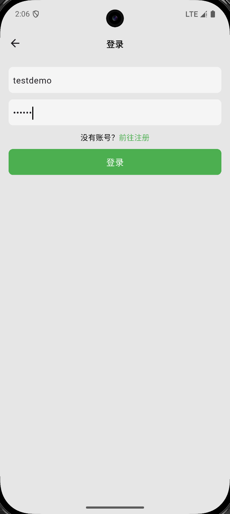
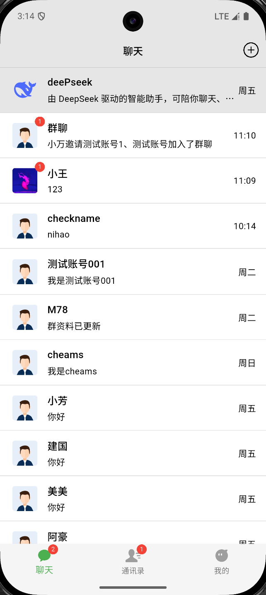
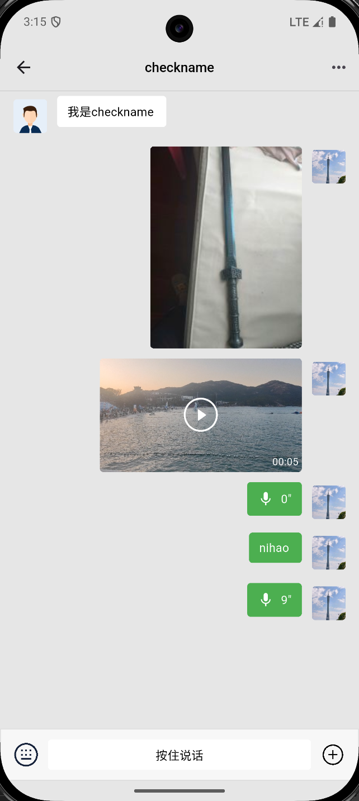
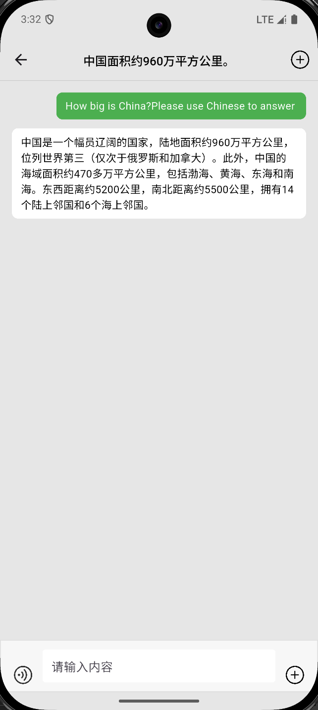
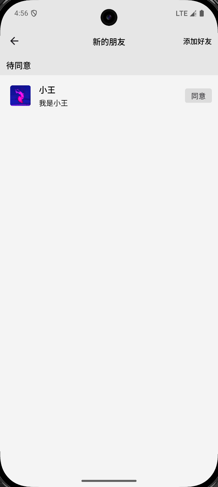
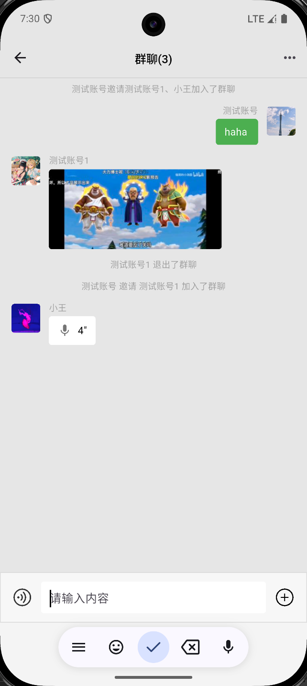
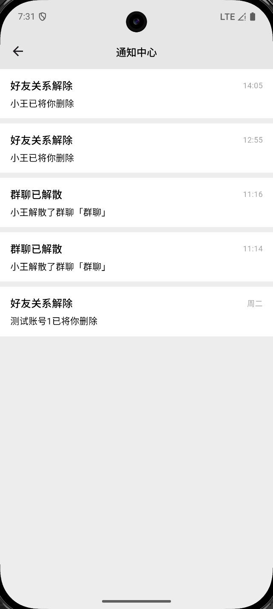
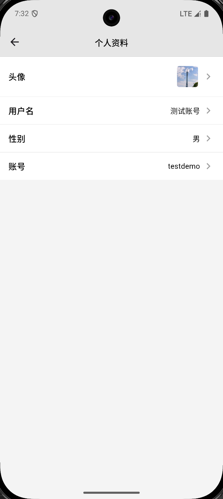

# 即时通讯 App

基于 Flutter + 腾讯云 IM 的即时通讯客户端（仓库名 `chat_demo`）。覆盖单聊 / 群聊、多媒体消息、会话未读、好友关系与通知中心等，适合本地演示与简历项目展示。

## 技术栈

- **框架**：Flutter（SDK ^3.38.6） / Dart（SDK ^3.10.7）
- **IM**：腾讯云即时通信 IM（`tencent_cloud_chat_sdk`）
- **网络**：Dio
- **状态 / 本地**：Provider、SharedPreferences
- **地图**：tencent_map_flutter
- **其它**：图片/相册选择与压缩、录音与播放、视频预览、字母通讯录（AzListView）等

## 运行

1. 安装并切换到可用的 Flutter 环境（建议与工程 Dart SDK 约束兼容）。
2. 在项目根目录执行：

```bash
flutter pub get
flutter run
```

3. 演示依赖可访问的业务后端（登录后下发 IM 凭证与接口数据）。请保证真机/模拟器能访问后端服务。

## 测试账号

密码均为：`123456`。登录填「账号」；App 内展示的是「用户名」，搜索好友 / 勾选拉群时按用户名辨认即可。

| 账号（登录用） | 用户名（App 内显示） | 说明 |
|----------------|----------------------|------|
| testdemo | 测试账号 | 主账号，日常演示用；与 test001 已是好友 |
| test001 | 测试账号001 | 用于单聊、建群等 |
| test002 | 测试账号002 | 与主账号非好友，用于加好友 / 好友申请流程 |

建议：一台设备登录 `testdemo`，另一台登录 `test001` / `test002`，便于看收消息与未读。

## 功能概览

- 登录 / 注册
- 会话列表（业务后端）+ 会话未读 / 总未读（IM）
- 单聊：文本、图片、语音、视频等
- 群聊：发起群聊、邀请成员、群资料、退群 / 解散
- AI 会话（业务侧对话，非 IM 会话）
- 通讯录、搜索添加好友、好友申请与同意
- 通知中心（如好友删除、群解散等）
- 个人资料（头像、昵称等）

## 测试流程

> 截图可放在对应场景下，路径示例：`docs/screenshots/xxx.png`（目录可自行创建后补图）。

### 1. 登录 / 注册

1. 打开 App，使用账号 `testdemo` + `123456` 登录；或注册新账号。
2. 登录成功进入首页（聊天 / 通讯录 / 我的）。



### 2. 单聊与未读

1. `testdemo`（用户名：测试账号）与 `test001`（用户名：测试账号001）互发文字、图片或视频。
2. 接收方不在该会话时，首页会话项与底部「聊天」出现未读角标。
3. 进入对应聊天后，未读应清除；页内继续收消息退出后也不应残留未读。




### 3. AI 聊天

1. 在会话列表进入 AI 会话。
2. 发送消息，确认能正常往返展示。  
   （说明：AI 为业务会话，不走 IM 未读，首页不展示 IM 角标属预期。）



### 4. 加好友

1. `testdemo` 搜索并添加用户名「测试账号002」（对应账号 `test002`）。
2. `test002` 侧：通讯录「新的朋友」与底部「通讯录」角标增加；进入新的朋友列表后角标清除。
3. 同意申请后，双方好友列表与会话能力可用。



### 5. 群聊

1. `testdemo` 发起群聊，勾选用户名「测试账号001」等成员创建。
2. 群内收发消息；在群信息中可邀请成员、修改群名等。
3. 可按角色体验退群或解散；相关通知见「通知中心」。



### 6.位置地图

1. 单聊或群聊中点击+号按钮，选择位置进入当前位置页面。
2. 选择当前位置并点击发送，即可发送位置信息。

！[位置]()

### 7. 通知中心

1. 通讯录「群聊」下方进入「通知中心」。
2. 查看好友删除、群解散等通知文案；进入后未读应清除，通讯录 Tab 总未读随之变化。



### 8. 个人信息

1. 「我的」进入个人资料。
2. 修改头像、昵称等并保存，确认个人页与相关展示已更新。



## 设计说明

- **会话列表与未读分离**：列表与最后一条摘要由业务后端维护；单聊/群聊未读与总未读来自腾讯云 IM（按 `c2c_` / `group_` 会话 ID 关联展示）。
- **进会话标已读**：进入聊天页、页内收到当前会话消息、离开页面时调用 IM 清除该会话未读。
- **自定义消息同步**：好友申请、被删好友、群解散等通过 IM 自定义消息触发前端刷新申请/通知/会话，并在对应聊天页内主动退出。
- **AI 会话**：走业务接口，无 IM 会话，故不做 IM 未读角标（有意为之）。
- **视频消息接收端**：本地路径可能为空，通过 `getMessageOnlineUrl` 获取在线地址后展示封面与播放。
